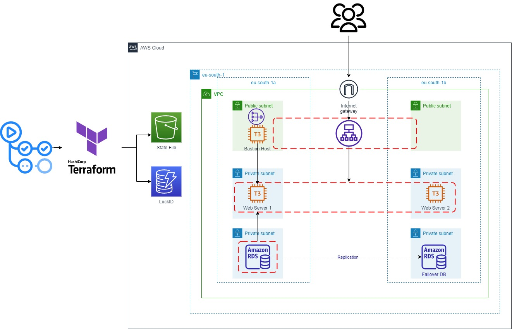

# 🚀 Deploying AWS 3-Tier Web App with Terraform, Docker & GitHub Actions

> **Fully automated CI/CD pipeline** — every `git push` builds a Docker image, provisions AWS infrastructure with Terraform, and deploys a containerised Flask app onto two EC2 instances behind an Application Load Balancer.

---

## 📋 Table of Contents

- [Project Overview](#-project-overview)
- [Architecture](#-architecture)
- [Tech Stack](#-tech-stack)
- [Repository Structure](#-repository-structure)
- [Terraform Modules](#-terraform-modules)
- [The Flask Application](#-the-flask-application)
- [Ansible Provisioning](#-ansible-provisioning)
- [CI/CD Pipeline](#-cicd-pipeline)
- [Prerequisites](#-prerequisites)
- [Setup & Deployment](#-setup--deployment)
- [Terraform Outputs](#-terraform-outputs)
- [Variable Reference](#-variable-reference)
- [To-Do](#-to-do)
- [References](#-references)

---

## 📌 Project Overview

This project automates the end-to-end deployment of the **Monty Hall Game** — a Python Flask web app — onto a production-grade AWS 3-tier architecture.

**What happens on every `git push`:**

1. 🐳 Docker image is built and pushed to **AWS ECR** (tagged with the commit SHA)
2. 🏗️ AWS infrastructure is provisioned via **Terraform**
3. ⚙️ EC2 instances are provisioned with **Ansible** (Docker installed, container pulled & run)
4. 🌐 App is live behind an **Application Load Balancer**

---

## 🏛️ Architecture



### Network Layout — VPC: `10.0.0.0/16` (Region: `eu-south-1`)

| Subnet | CIDR | AZ | Purpose |
|--------|------|----|---------|
| `public_subnet_1` | `10.0.1.0/24` | eu-south-1a | ALB + Bastion Host |
| `public_subnet_2` | `10.0.2.0/24` | eu-south-1b | ALB |
| `private_app_subnet_1` | `10.0.3.0/24` | eu-south-1a | App EC2 Instance 1 |
| `private_app_subnet_2` | `10.0.4.0/24` | eu-south-1b | App EC2 Instance 2 |
| `private_db_subnet_1` | `10.0.5.0/24` | eu-south-1a | Reserved (RDS / ElastiCache) |
| `private_db_subnet_2` | `10.0.6.0/24` | eu-south-1b | Reserved (RDS / ElastiCache) |

### Security Groups

| Security Group | Inbound | Notes |
|----------------|---------|-------|
| `ALBSG` | `0.0.0.0/0 → TCP 80` | Public HTTP |
| `BastionSG` | `0.0.0.0/0 → TCP 22` | SSH management |
| `InstanceSG` | `ALBSG → 80`, `BastionSG → 22` | No direct internet access |
| `RDSSG` | `VPC CIDR → TCP 3306` | MySQL — internal only |
| `ElastiCacheSG` | `VPC CIDR → TCP 6379` | Redis — internal only |

---

## 🛠️ Tech Stack

| Layer | Technology |
|-------|-----------|
| **Application** | Python · Flask 2.2.2 |
| **Containerisation** | Docker (python:3.11.1-slim-buster) |
| **Container Registry** | AWS ECR |
| **Infrastructure (IaC)** | Terraform (AWS provider ~> 4.0) |
| **Provisioning** | Ansible |
| **CI/CD** | GitHub Actions |
| **State Management** | S3 (state file) + DynamoDB (locking) |
| **Compute** | EC2 t3.micro × 3 (2 app + 1 bastion) |
| **Load Balancing** | AWS Application Load Balancer |
| **Networking** | VPC · IGW · NAT Gateway · Elastic IP |

---

## 📁 Repository Structure

```
.
├── Monty_Hall_Game_Flask_App/
│   ├── app.py                    # Routes + game logic
│   ├── Dockerfile
│   ├── requirements.txt          # Flask 2.2.2
│   ├── static/                   # Door / car / goat images
│   └── templates/
│       ├── root.html             # Landing page
│       ├── select.html           # Door selection
│       ├── select_again.html     # Switch or stay decision
│       ├── result.html           # Win / loss reveal
│       └── bot.html              # Bot simulation results
│
├── Terraform/
│   ├── main.tf                   # Root — wires all modules
│   ├── provider.tf               # AWS provider config
│   ├── backend.tf                # Remote state (S3 + DynamoDB)
│   ├── variables.tf              # Input variable declarations
│   ├── terraform.tfvars          # Variable values
│   ├── output.tf                 # ALB DNS · Bastion IP · VPC ID
│   └── Modules/
│       ├── VPC/                  # VPC · subnets · IGW · NAT · routes
│       ├── SG/                   # All 5 security groups
│       ├── EC2/                  # Key pair + 3 EC2 instances
│       └── ALB/                  # ALB · target group · listener
│
├── ansible/
│   ├── ansible.cfg               # Inventory · privilege escalation
│   └── docker_playbook.yml       # Install Docker · pull & run ECR image
│
└── assests/
    └── AWS-Three-Tier-Architecture.jpg
```

---

## 🧩 Terraform Modules

### `VPC` Module
Creates: VPC (DNS hostnames enabled) · Internet Gateway · Elastic IP · NAT Gateway (in AZ-a public subnet) · 6 subnets · 3 route tables (1 public via IGW, 2 private via NAT) · all route table associations.

### `SG` Module
Creates all 5 security groups. `InstanceSG` uses `depends_on` to reference `ALBSG` and `BastionSG` as source security groups, ensuring correct creation order.

### `EC2` Module
Creates an `aws_key_pair` from the injected public key, then launches:
- **Bastion** — `public_subnet_1`, public IP, `BastionSG`
- **App Instance 1** — `private_app_subnet_1`, no public IP, `InstanceSG`
- **App Instance 2** — `private_app_subnet_2`, no public IP, `InstanceSG` (includes Apache bootstrap for initial ALB health-check validation)

### `ALB` Module
Creates: internet-facing ALB across both public subnets · HTTP target group with health checks (`path=/`, interval 25s, timeout 8s) · target group attachments for both app instances · HTTP:80 listener forwarding to the target group.

### Remote State Backend
```hcl
# Terraform/backend.tf
terraform {
  backend "s3" {
    bucket         = "tfstate-for-locking"
    key            = "terraform.tfstate"
    region         = "eu-south-1"
    dynamodb_table = "state_table"
  }
}
```

---

## 🎮 The Flask Application

The app is a web implementation of the [Monty Hall Problem](https://en.wikipedia.org/wiki/Monty_Hall_problem).

### Routes

| Route | Method | Description |
|-------|--------|-------------|
| `/` | GET | Landing page |
| `/select` | GET | Choose one of 3 doors |
| `/select_again` | POST | Host reveals goat door — switch or stay? |
| `/result` | POST | Final reveal — car 🚗 or goat 🐐 |
| `/bot` | GET | Bot runs 1 000 simulations and shows win-rate stats |

### Dockerfile

```dockerfile
FROM python:3.11.1-slim-buster
WORKDIR /home/app
COPY requirements.txt .
RUN pip install -r requirements.txt
COPY . .
EXPOSE 5000
CMD ["flask", "run", "--host=0.0.0.0"]
```

The ALB listener on port 80 + Docker's `-p 80:5000` mapping bridge public traffic to the Flask app.

---

## ⚙️ Ansible Provisioning

The playbook (`ansible/docker_playbook.yml`) runs against the private EC2 instances via the Bastion SSH proxy:

1. `yum update -y`
2. Install Docker via `amazon-linux-extras`
3. Start Docker service
4. Pull ECR image (tagged with commit SHA)
5. `docker run -d --name ECR-Container -p 80:5000 <ecr-image>`

`ansible.cfg` disables host key checking and enables passwordless `sudo` escalation — appropriate for ephemeral CI-provisioned instances.

---

## 🔄 CI/CD Pipeline

The workflow triggers on every `git push` and can also be run **manually** (with an option to destroy resources).

### Jobs

```
git push
    │
    ├─► 1. Build & Push Docker Image  ──► AWS ECR (tagged with commit SHA)
    │
    ├─► 2. Terraform Apply            ──► Provisions all AWS infrastructure
    │
    └─► 3. Ansible Provision          ──► Installs Docker, pulls & runs container
                                          on both private EC2 instances
```

### Required GitHub Secrets

| Secret | Description |
|--------|-------------|
| `AWS_ACCESS_KEY_ID` | IAM access key |
| `AWS_SECRET_ACCESS_KEY` | IAM secret key |
| `EC2_PUBLIC_SSH_KEY` | Contents of `ssh_key_aws.pub` → injected as `TF_VAR_public_key` |
| `EC2_PRIVATE_SSH_KEY` | Contents of `ssh_key_aws` → used by Ansible to SSH via Bastion |

---

## ✅ Prerequisites

Before running the pipeline, ensure the following exist in `eu-south-1`:

- [ ] **S3 bucket** named `tfstate-for-locking`
- [ ] **DynamoDB table** named `state_table` (partition key: `LockID`, type: `String`)
- [ ] **ECR repository** for `monty-hall-game` — update the image URI in `ansible/docker_playbook.yml`
- [ ] **Valid AMI ID** for your region — update `ami` in `terraform.tfvars`
- [ ] IAM credentials with permissions for: VPC · EC2 · ALB · ECR · S3 · DynamoDB

---

## 🚀 Setup & Deployment

### 1. Generate SSH Key Pair

```bash
ssh-keygen          # filename: ssh_key_aws — press Enter twice for no passphrase
chmod 400 ssh_key_aws

cat ssh_key_aws        # → paste into GitHub Secret: EC2_PRIVATE_SSH_KEY
cat ssh_key_aws.pub    # → paste into GitHub Secret: EC2_PUBLIC_SSH_KEY
```

### 2. Add GitHub Secrets

Go to **Settings → Secrets and variables → Actions** and add all four secrets from the table above.

### 3. Trigger the Pipeline

Push any commit to `main`, or go to the **Actions** tab → select the workflow → click **Run workflow**.

### 4. Access the App

Once the pipeline completes, go to **AWS Console → EC2 → Load Balancers** and open the ALB's DNS name in your browser.

---

## ⚠️ Destroying Resources

> **This project uses paid AWS services.** NAT Gateways, EC2 instances, and ALBs accrue hourly charges. **Always destroy resources when finished.**

**Option A — via GitHub Actions (recommended):**
Go to **Actions** → select the workflow → **Run workflow** → choose `destroy`.

**Option B — manual:**
Delete resources from the AWS Console in this order: EC2 Instances → Target Groups → ALB → NAT Gateway → Elastic IP → Subnets → VPC.

---

## 📤 Terraform Outputs

| Output | Description |
|--------|-------------|
| `alb_dns_name` | Paste into browser to reach the app |
| `bastion_public_ip` | SSH into the bastion to access private instances |
| `vpc_id` | ID of the created VPC |
| `nat_eip` | Elastic IP of the NAT Gateway |

---

## 📊 Variable Reference

| Variable | Default | Description |
|----------|---------|-------------|
| `region` | `eu-south-1` | AWS deployment region |
| `vpc_cidr` | `10.0.0.0/16` | VPC CIDR block |
| `public_subnet_1_cidr` | `10.0.1.0/24` | Public subnet AZ-a |
| `public_subnet_2_cidr` | `10.0.2.0/24` | Public subnet AZ-b |
| `private_app_subnet_1_cidr` | `10.0.3.0/24` | App subnet AZ-a |
| `private_app_subnet_2_cidr` | `10.0.4.0/24` | App subnet AZ-b |
| `private_db_subnet_1_cidr` | `10.0.5.0/24` | DB subnet AZ-a |
| `private_db_subnet_2_cidr` | `10.0.6.0/24` | DB subnet AZ-b |
| `ami` | `ami-0185600d76ba787f4` | Amazon Linux 2 AMI *(update per region)* |
| `ec2_instance_type` | `t3.micro` | Instance size for all EC2s |
| `key_name` | `ssh_key_aws` | Key pair name in AWS |
| `public_key` | *(from GitHub Secret)* | SSH public key content |
| `alb_name` | `my-application-load-balancer` | ALB resource name |
| `target_group_name` | `my-alb-target-group` | Target group resource name |

---

## 📝 To-Do

- [ ] Replace static Ansible inventory with `aws_ec2` dynamic inventory plugin
- [ ] Lambda function to send email notification on Terraform state file change
- [ ] Add HTTPS/TLS with ACM certificate + HTTP→HTTPS redirect on ALB
- [ ] Provision RDS (MySQL) and ElastiCache (Redis) in the reserved DB tier
- [ ] Restrict Bastion SG ingress to a known IP CIDR instead of `0.0.0.0/0`

---

## 📚 References

1. [GitHub Actions Tutorial — Nana Janashia](https://www.youtube.com/watch?v=R8_veQiYBjI)
2. [GitHub Actions Official Docs](https://docs.github.com/en/actions)
3. [AWS 3-Tier Architecture — Tech with Lucy](https://www.youtube.com/watch?v=5RVT3BN9Iws)
4. [Original Project Idea](https://www.youtube.com/watch?v=xIyDhaIfC1I)

---

<div align="center">
  <sub>Built by <a href="https://github.com/ENSiGN-CODES">ENSiGN-CODES</a></sub>
</div>
